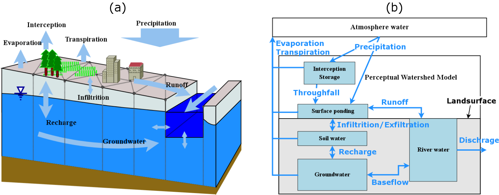
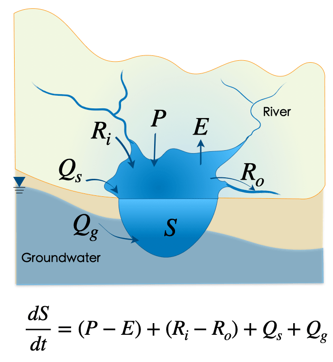
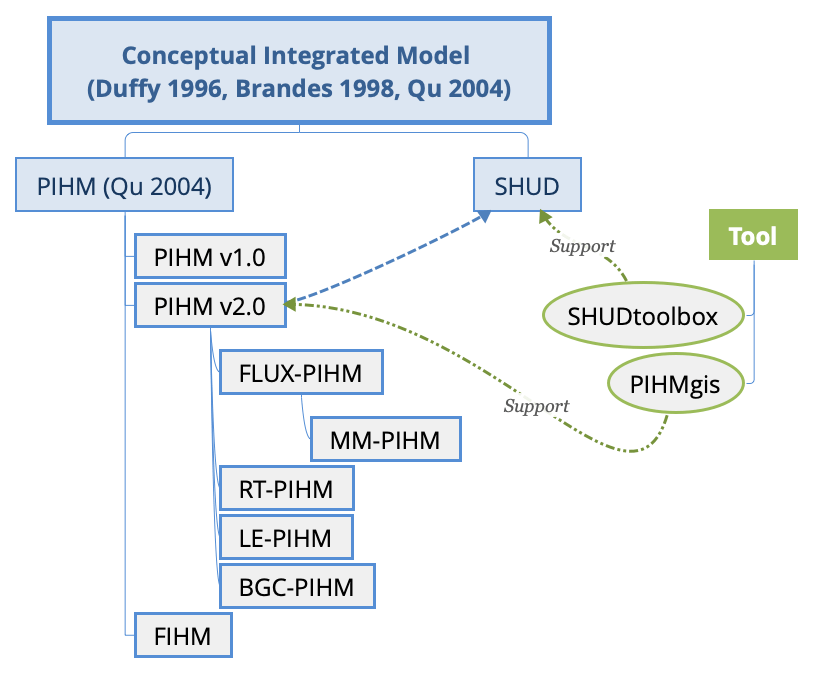
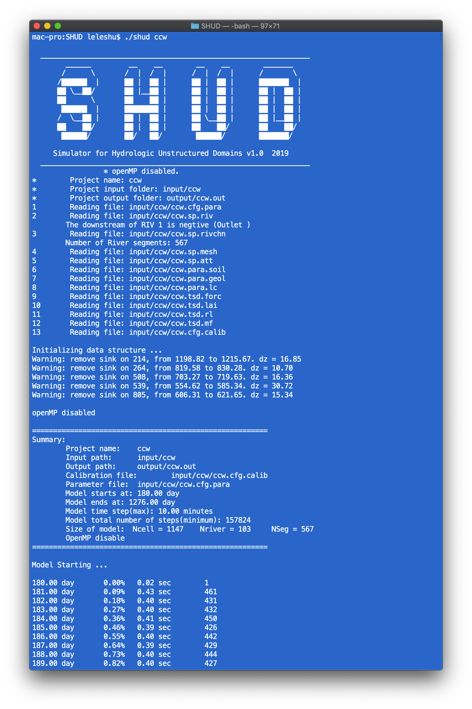

# Simulator for Hydrologic Unstructured Domains

## Brief

The Simulator for Hydrologic Unstructured Domains  (SHUD - pronounced “SHOULD”) is a multi-process, multi-scale hydrological model where major hydrological processes are fully coupled using the semi-discrete **Finite Volume Method** (FVM).

Ongoing applications of the SHUD model include hydrologic analyses of hillslope to regional scales  (1 $ m^2 $ to $10^6$ $\mbox{km}^2$), water resource and stormwater management, and interdisciplinary research for questions in limnology, agriculture, geochemistry, geomorphology, water quality, ecology, climate and land-use change. The strength of SHUD is its flexibility as a scientific and resource evaluation tool where modeling and simulation are required.


- **Maintainner**: Lele Shu ([shulele@lzb.ac.cn](mailto:shulele@lzb.ac.cn))
- **Website (中文)**: [www.shud.xyz/](https://www.shud.xyz/)
- **Website (English)**: [www.shud.xyz/en/](https://www.shud.xyz/en/)
- **User Guide**: [https://www.shud.xyz/book_cn/](https://www.shud.xyz/book_cn/)
- **Support tools**: rSHUD.  [https://github.com/SHUD-System/rSHUD](https://github.com/SHUD-System/rSHUD)
- **Programming**: C/C++
- **Platform**: Mac OS, Linux and Windows
- **Required library**:  SUNDIALS/CVODE V6.0+
- **Parallelization** : OpenMP

## Overview

The Simulator for Hydrologic Unstructured Domains (SHUD) is a multi-process, multi-scale model where major hydrologic processes are fully coupled using the **Finite Volume Method (FVM)**. SHUD encapsulates the strategy for the synthesis of multi-state distributed hydrologic models using the integral representation of the underlying physical process equations and state variables.


The conceptual structure of the ***two-state integral-balance*** model for soil moisture and groundwater dynamics was originally devised by (Duffy, 1996), in which the partial volumes occupied by unsaturated and saturated moisture storage were integrated directly into a local conservation equation. This two-state integral-balance structure simplified the hydrologic dynamics while preserving the natural spatial and temporal scales contributing to runoff response.

SHUD's design is based on a concise representation of a watershed and river basin's hydrodynamics, which allows for interactions among major physical processes operating simultaneously, but with the flexibility to add or drop state-process-constitutive relations depending on the objectives of the numerical experiment.



The latest version of SHUD (v2.0) supports the simulation of coupled lake model.



As an intellectual descendant of Penn State Integrated Hydrologic Model (**PIHM**), the SHUD model is a continuation of 16 years of PIHM model development in hydrology and related fields since the release of its first PIHM version  (Qu, 2004).



###The formulation and results from SHUD. 

- SHUD is a physically-based process spatially distributed catchment model. The model applies national geospatial data resources to simulate surface and subsurface flow in gaged or ungaged catchments. SHUD represents the spatial heterogeneity that influences the hydrology of the region based on national soil data and superficial geology. Several other groups have used PIHM, a SHUD ancestor to couple processes from biochemistry, reaction transport, landscape, geomorphology, limnology, and other related research areas.

- SHUD is a fully-coupled hydrologic model, where the conservative hydrologic fluxes are calculated within the same time step. The state variables are the height of ponding water on the land surface, soil moisture, groundwater level, and river stage, while fluxes are infiltration, overland flow, groundwater recharge, lateral groundwater flow, river discharge, and exchange between river and hillslope cells.

- The global ODE system in SHUD is solved with a state-of-the-art parallel ODE solver, known as CVODE developed at Lawrence Livermore National Laboratory.

- SHUD permits adaptable temporal and spatial resolution. The spatial resolution of the model varies from centimeters to kilometers based on modeling requirements computing resources. The internal time step of the iteration is adjustable and adaptive; it can export the status of a catchment at time-intervals from minutes to days.  The flexible spatial and temporal resolution of the model makes it valuable for coupling with other systems.

- SHUD can estimate either a long-term hydrologic yield or a single-event flood.

- SHUD is an open-source model, available on GitHub.

  


## Compilation (Linux or Mac) and run the example watersheds

**Step 0: download the latest source code**

```
git clone git@github.com:SHUD-System/SHUD.git
cd SHUD
```

**Step 1: Install SUNDIALS/CVODE 6.x:**

```
./configure
```

This configure is to download the SUNDIALS from GitHub and install it on your computer.

**Step 2: Compile SHUD with gcc**

```
make clean
make shud

```

If you don't use `gcc`, you may edit the *Makefile* before compiling.

**Step 3: Run the North Fork Cache Creek Watershed example**

```
./shud ccw
```

The screen looks shoud be:


**Step4: Analysis the results of modeling.**

The output files from the SHUD model is save in `./output/ccw.out`.  The R package, SHUDtoolbox, helps to load the input/output files of SHUD. More details about prepare SHUD data, model input/output and visualization is available in SHUD website (https://www.shud.xyz) and help information of SHUDtoolbox.

---

## OpenMP parallel build (v1.0.1+)

`make shud_omp` produces a shared-memory OpenMP-parallel binary. Since
**v1.1.1** the default build is **Config E** (OpenMP NVector element-wise
ops + SHUD serial reduction overrides, on top of StrictOMP RHS) — it
parallelizes both the right-hand-side (RHS) evaluation *and* CVODE's
internal vector operations, yet stays **bitwise-identical to the older
Config C default at every thread count**. On `heihe_x4` (40,046 elements,
90-day) the RHS layer alone (Config C) delivers **~1.8× at N=8, ~1.95× at
N=16**; the default Config E adds the NVector layer for **≈2.62× vs serial
@N16** (1.41× over Config C), and the opt-in Config E2 reaches **≈3.55× vs
serial**. Every config is A5 hydrology-acceptance PASS. Full scaling table
in `RELEASE.md` §Scaling profile; config picker below. To get the older
Serial-NVector Config C binary, opt out with
`make shud_omp SHUD_USE_OPENMP_NVECTOR=0`.

### Which build do I want? (quick pick)

| Your situation | Build this | One-line command |
|---|---|---|
| Default — fast **and** bitwise-identical to the Config C reference at any thread count | **Config E** (default, v1.1.1) | `make shud_omp` |
| Strict minimal-dependency / serial-NVector debug build (no `nvecopenmp` link) | **Config C** (opt-out) | `make shud_omp SHUD_USE_OPENMP_NVECTOR=0` |
| Want the **fastest** run; OK adopting a new (A5-certified) reference once | **Config E2** (v1.1) | `make shud_omp SHUD_NVEC_DETRED=1` |

All three are the same physics and the same solver — they differ only in
which parts of the linear-algebra layer run in parallel and, for E2, the
(deterministic) order of floating-point summation. Whichever you pick,
results are **reproducible across thread counts** (run at N=1 today and
N=16 tomorrow: same output, bit for bit — within that config's lineage).

Since **v1.1.1** the default `make shud_omp` builds **Config E**, not Config
C. E is bitwise-identical to Config C at every thread count (so nothing you
validated against Config C changes) and 1.41× faster @N16 — a pure Pareto
upgrade. If you specifically need the Serial-NVector Config C binary (e.g.
a strict minimal-dependency build with no `libsundials_nvecopenmp` link, or
for NVector-layer debugging), opt out with the single flag
`make shud_omp SHUD_USE_OPENMP_NVECTOR=0`. Config E2 no longer needs all
three flags — `SHUD_NVEC_DETRED=1` alone suffices under `make shud_omp`
because `SHUD_NVEC_HYBRID` now defaults on there.

### Important: threads are OpenMP threads, not MPI processes

SHUD-OpenMP (v1.0.x and v1.1) is **single-node shared-memory** parallel.
One `shud_omp` process fork-joins N OpenMP threads inside the RHS (and,
for Config E/E2, inside CVODE's vector operations). It does **not** use
MPI and cannot distribute across nodes. Multi-node domain decomposition
(P10) is deferred; there is currently no path to use two compute nodes
for one simulation.

### Build

```bash
./configure          # downloads SUNDIALS/CVODE 6.0.0
make shud_omp        # Config E by default (v1.1.1): OpenMP NVec element-wise
                     #   + serial reduction overrides + StrictOMP RHS
```

No compile-time flags required. The default is **Config E** since v1.1.1
(bitwise-identical to the older Config C default, 1.41×@N16 faster). Verify
the build got the hybrid NVector path (the Config E startup marker is
compiled in only when the hybrid overrides are active):

```bash
strings shud_omp | grep "NVEC config: Config E"   # >=1 line for Config E/E2
strings shud_omp | grep SHUD_RHS_THREADS          # >=1 line: StrictOMP RHS present
```

At run time the binary prints one authoritative
`NVEC config: Config E (serial reduction overrides; DETRED=off)` line — trust
that over the compiled-in strings (both the E and E2 format strings are
present in any hybrid binary; only one branch executes).

### Run — specifying thread count

Three environment-variable channels, priority high→low:

| Variable                  | Effect                                                                                                | Recommendation |
|---------------------------|-------------------------------------------------------------------------------------------------------|:--:|
| `SHUD_RHS_THREADS=N`      | Canonical RHS thread knob. SHUD reads this directly and calls `omp_set_num_threads(N)` at startup.    | ✓ set explicitly |
| `OMP_NUM_THREADS=N`       | Standard OpenMP env. Fallback source for `omp_get_max_threads()` when `SHUD_RHS_THREADS` is unset.    | ✓ set to same N |
| (neither set)             | `omp_get_max_threads()` uses OpenMP runtime default (typically = logical CPU count). Unpredictable.   | ✗ avoid |

Also set thread pinning — without these the OS scheduler bounces threads
between cores and inflates wall by 10–20%:

```bash
export OMP_PROC_BIND=close
export OMP_PLACES=cores
```

Full runtime example (heihe_x4, 8 threads):

```bash
export OMP_NUM_THREADS=8
export SHUD_RHS_THREADS=8
export OMP_PROC_BIND=close
export OMP_PLACES=cores
./shud_omp heihe_x4
```

### Thread count guidance (measured on `heihe_x4`, node-exclusive Xeon)

| Scenario                                | Recommended N | Rationale                                                       |
|-----------------------------------------|:-------------:|-----------------------------------------------------------------|
| `heihe_x4` sweet spot (ROI vs wall)     | **N=8**       | sp = 1.80×, efficiency 22.6%                                    |
| `heihe_x4` shortest wall                | N=16          | sp = 1.95×, but only 8% wall gain over N=8; efficiency drops to 12% |
| Small cases (`keliya`, 484 elements)    | N=1           | OMP overhead > RHS gain at this size; consider `SHUD_SPGMR_MAXL=30` opt-in instead |
| Thread count > physical core count      | ✗ don't       | Hyperthreads yield no gain and often regress                    |
| Cross-node distributed                  | ✗ impossible  | Single-node OpenMP only in v1.0.x                               |

Amdahl parallel fraction on `heihe_x4` is ~0.51, so the theoretical
speedup ceiling is near 2× regardless of thread count. Adding threads
beyond N=16 will not exceed this. **v1.1 lifts this ceiling** — the
Config E/E2 opt-in legs below parallelize the CVODE-internal NVector
work that constitutes most of that serial remainder.

### Config E / E2 — deterministic hybrid NVector (v1.1+, opt-in)

Two build legs parallelize CVODE's internal vector operations
(element-wise + reductions ≈ 86% of raw CVODE time at N=16 on
`heihe_x4`). Since **v1.1.1**, **Config E is the default** `make shud_omp`
build; Config E2 is one extra flag.

```bash
# Config E — OpenMP element-wise NVector + serial reduction overrides.
#            DEFAULT since v1.1.1. BITWISE-IDENTICAL to Config C at every
#            thread count. (Explicit long form still works and is
#            equivalent: SHUD_USE_OPENMP_NVECTOR=1 SHUD_NVEC_HYBRID=1.)
make shud_omp

# Config E2 — Config E + fixed-tree deterministic parallel reductions
#             (block size B=4096 via SHUD_NVEC_DETRED_B). Cross-thread
#             bitwise BY CONSTRUCTION, but a ONE-TIME summation-order
#             shift vs C/E => new golden lineage (A5-certified:
#             nse=1.0000 / kge=0.9999 vs Config C). SHUD_NVEC_HYBRID
#             now defaults on under shud_omp, so DETRED=1 alone selects E2.
make shud_omp SHUD_NVEC_DETRED=1

# Config C — Serial-NVector opt-out (strict minimal-dependency / debug).
make shud_omp SHUD_USE_OPENMP_NVECTOR=0
```

Measured on `heihe_x4` (90-day, node-exclusive Xeon, 3-run medians):

| Config @N16 | wall (s) | vs Config C @N16 | vs serial |
|---|---:|---:|---:|
| C (default)  | 694 | 1.00× | 1.86× |
| E            | 492 | 1.41× | 2.62× |
| E2           | 363 | **1.915×** | **≈3.55×** |

Thread-count knob for E/E2: the NVector thread count comes from the
**cfg.para `NUM_OPENMP`** field (not `OMP_NUM_THREADS` alone) — set both
to the same N. Note Config E at cfg N=1 runs a 2-thread NVector floor.
Determinism contract: E == C bitwise everywhere; E2 is thread-count-
invariant but order-shifted once — validate E2 against an E2 golden,
never mix goldens across the C/E ↔ E2 boundary. Authority:
`docs/adr/0011-*.md` + `docs/p12-nvec/` in the SHUD-OpenMP repo.

### Slurm single-node example

```bash
#!/bin/bash
#SBATCH --job-name=shud-heihe_x4
#SBATCH --partition=CPU
#SBATCH --nodes=1
#SBATCH --exclusive             # critical: no memory-bandwidth sharing
#SBATCH --ntasks=1              # one shud_omp process
#SBATCH --cpus-per-task=8       # give it 8 cores
#SBATCH --mem=32G
#SBATCH --time=00:30:00
#SBATCH --output=slurm-%j.out

export OMP_NUM_THREADS=${SLURM_CPUS_PER_TASK}
export SHUD_RHS_THREADS=${SLURM_CPUS_PER_TASK}
export OMP_PROC_BIND=close
export OMP_PLACES=cores

./shud_omp heihe_x4
```

`--exclusive` matters: on a shared node another tenant's memory
bandwidth pressure will silently steal ~30% of the speedup. If you can't
reserve the node exclusively, expect noisier and lower speedup numbers
than the scaling table.

### Common pitfalls

- **"Set `OMP_NUM_THREADS=16` but wall time didn't change"** — most likely
  the binary was built with an old default. Pre-v1.0.1 `shud_omp` was
  Config B (no StrictOMP RHS); pre-v1.1.1 it was Config C (Serial NVector,
  RHS-only parallelism). Check what you have:
  `strings shud_omp | grep SHUD_RHS_THREADS` (empty ⇒ pre-v1.0.1, no
  StrictOMP RHS) and `strings shud_omp | grep "NVEC config: Config E"`
  (empty ⇒ Config C or older, NVector layer still serial — v1.1.1 default
  should show it). If either is missing and you want the current default,
  rebuild: `make clean && make shud_omp`.
- **"Two nodes together should be faster"** — no. Each node runs an
  independent job. There is no MPI in v1.0.x.
- **`OMP_NUM_THREADS=64` on a 40-core node** — oversubscription. Threads
  contend for cores and wall regresses. Cap at physical core count.
- **Shared-tenant node** — memory bandwidth is a limited resource that
  Amdahl-bound OpenMP workloads spend heavily. Use `--exclusive` or an
  idle node.
- **"Config E/E2 ignores `OMP_NUM_THREADS`"** (v1.1) — the NVector thread
  count is read from the **cfg.para `NUM_OPENMP`** field at project load,
  not from the environment alone. Set `NUM_OPENMP` *and*
  `OMP_NUM_THREADS` to the same N (see §Config E / E2). A startup log
  line prints the effective thread count — trust that line.
- **"E2 output differs from my old golden"** (v1.1) — expected, once.
  Config E2 changes the (deterministic) summation order, so it is not
  bit-equal to Config C/E history; it was re-baselined and A5-certified
  (NSE=1.0000 / KGE=0.9999 vs Config C). Validate E2 runs against an
  E2-lineage golden; never diff goldens across the C/E ↔ E2 boundary.
  Config E needs no such care — it is bit-equal to Config C everywhere.

### Reproducing the P1e A/B/D research configurations

For ADR-0002 A/B/D reproducibility (not for production use):

```bash
make shud                                     # Config A (canonical serial reference)
make shud_omp SHUD_ENABLE_OPENMP_RHS=0        # Config A/B (serial RHS via shud_omp target)
# Config D (OpenMP NVec WITHOUT hybrid overrides — REFUTED, nondeterministic).
# Since v1.1.1, SHUD_USE_OPENMP_NVECTOR=1 alone builds Config E (HYBRID
# defaults on under shud_omp), so Config D must be requested explicitly and
# is gated behind SHUD_ALLOW_CONFIG_D=1 (build-only smoke; do not run for
# results):
make shud_omp SHUD_NVEC_HYBRID=0 SHUD_ALLOW_CONFIG_D=1   # Config D (research/smoke only)
make shud SHUD_ENABLE_OPENMP_RHS=1            # Config C via shud target (Serial NVec + StrictOMP RHS)
make shud_omp SHUD_USE_OPENMP_NVECTOR=0       # Config C via shud_omp target (v1.1.1 opt-out)
```

See `RELEASE.md` and `docs/p1e/p1e_academic_summary.md` in the outer
repo for the configuration matrix and evidence.


