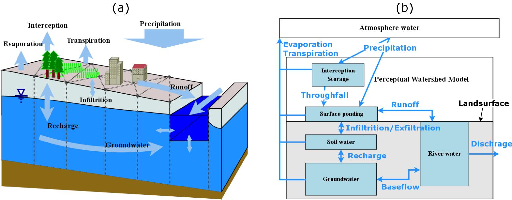
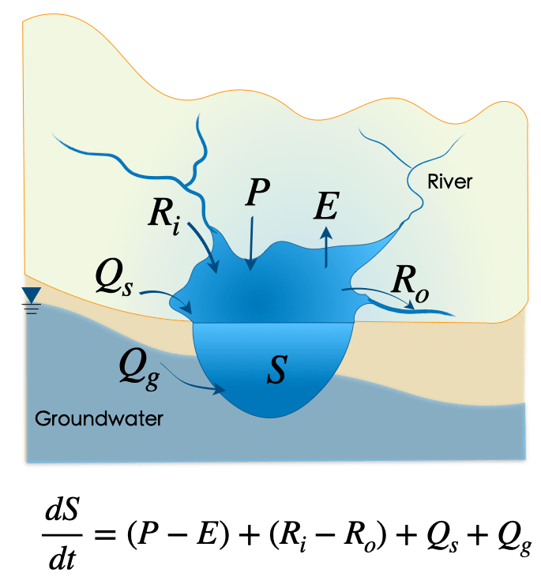
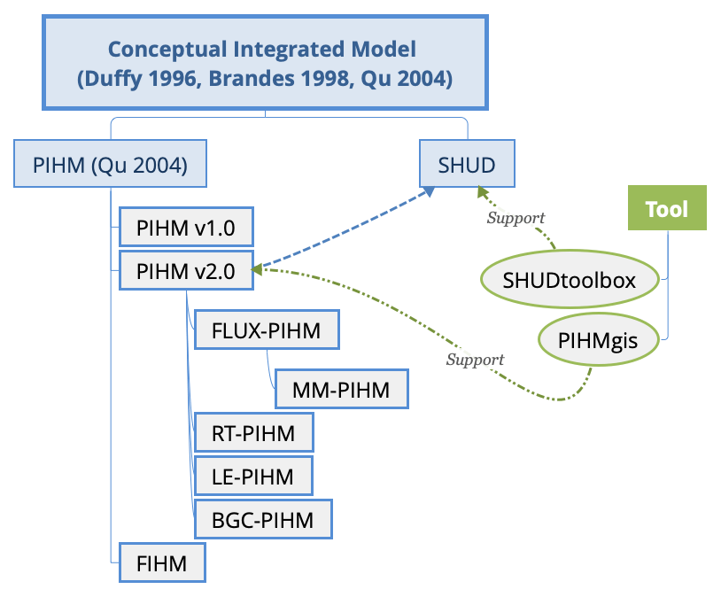
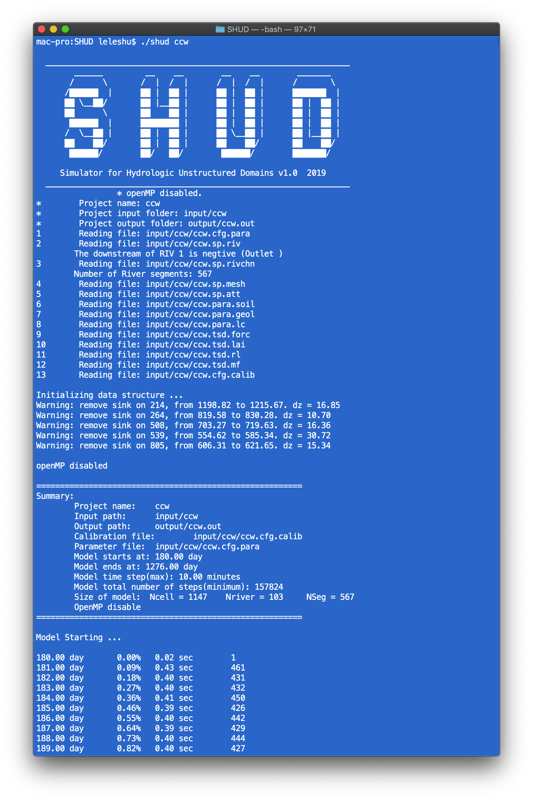

# Simulator for Hydrologic Unstructured Domains

## Brief

The Simulator for Hydrologic Unstructured Domains  (SHUD - pronounced “SHOULD”) is a multi-process, multi-scale hydrological model where major hydrological processes are fully coupled using the semi-discrete **Finite Volume Method** (FVM).

Ongoing applications of the SHUD model include hydrologic analyses of hillslope to regional scales  (1 $ m^2 $ to $10^6$ $\mbox{km}^2$), water resource and stormwater management, and interdisciplinary research for questions in limnology, agriculture, geochemistry, geomorphology, water quality, ecology, climate and land-use change. The strength of SHUD is its flexibility as a scientific and resource evaluation tool where modeling and simulation are required.


- **Maintainner**: Lele Shu ([shulele@lzb.ac.cn](mailto:shulele@lzb.ac.cn))
- **Website (中文)**: [www.shud.xyz/](https://www.shud.xyz/)
- **Website (English)**: [www.shud.xyz/en/](https://www.shud.xyz/en/)
- **User Guide**: [https://www.shud.xyz/book_cn/](https://www.shud.xyz/book_cn/)
- **Support tools**: rSHUD.  [https://github.com/SHUD-System/rSHUD](https://github.com/SHUD-System/rSHUD)
- **Programming**: C/C++
- **Platform**: Mac OS, Linux and Windows
- **Required library**:  SUNDIALS/CVODE V6.0+
- **Parallelization** : OpenMP

## Overview

The Simulator for Hydrologic Unstructured Domains (SHUD) is a multi-process, multi-scale model where major hydrologic processes are fully coupled using the **Finite Volume Method (FVM)**. SHUD encapsulates the strategy for the synthesis of multi-state distributed hydrologic models using the integral representation of the underlying physical process equations and state variables.


The conceptual structure of the ***two-state integral-balance*** model for soil moisture and groundwater dynamics was originally devised by (Duffy, 1996), in which the partial volumes occupied by unsaturated and saturated moisture storage were integrated directly into a local conservation equation. This two-state integral-balance structure simplified the hydrologic dynamics while preserving the natural spatial and temporal scales contributing to runoff response.

SHUD's design is based on a concise representation of a watershed and river basin's hydrodynamics, which allows for interactions among major physical processes operating simultaneously, but with the flexibility to add or drop state-process-constitutive relations depending on the objectives of the numerical experiment.



The latest version of SHUD (v2.0) supports the simulation of coupled lake model.



As an intellectual descendant of Penn State Integrated Hydrologic Model (**PIHM**), the SHUD model is a continuation of 16 years of PIHM model development in hydrology and related fields since the release of its first PIHM version  (Qu, 2004).



###The formulation and results from SHUD. 

- SHUD is a physically-based process spatially distributed catchment model. The model applies national geospatial data resources to simulate surface and subsurface flow in gaged or ungaged catchments. SHUD represents the spatial heterogeneity that influences the hydrology of the region based on national soil data and superficial geology. Several other groups have used PIHM, a SHUD ancestor to couple processes from biochemistry, reaction transport, landscape, geomorphology, limnology, and other related research areas.

- SHUD is a fully-coupled hydrologic model, where the conservative hydrologic fluxes are calculated within the same time step. The state variables are the height of ponding water on the land surface, soil moisture, groundwater level, and river stage, while fluxes are infiltration, overland flow, groundwater recharge, lateral groundwater flow, river discharge, and exchange between river and hillslope cells.

- The global ODE system in SHUD is solved with a state-of-the-art parallel ODE solver, known as CVODE developed at Lawrence Livermore National Laboratory.

- SHUD permits adaptable temporal and spatial resolution. The spatial resolution of the model varies from centimeters to kilometers based on modeling requirements computing resources. The internal time step of the iteration is adjustable and adaptive; it can export the status of a catchment at time-intervals from minutes to days.  The flexible spatial and temporal resolution of the model makes it valuable for coupling with other systems.

- SHUD can estimate either a long-term hydrologic yield or a single-event flood.

- SHUD is an open-source model, available on GitHub.

  


## Compilation (Linux or Mac) and run the example watersheds

**Step 0: download the latest source code**

```
git clone git@github.com:SHUD-System/SHUD.git
cd SHUD
```

**Step 1: Install SUNDIALS/CVODE 6.x:**

```
./configure
```

This configure is to download the SUNDIALS from GitHub and install it on your computer.

**Step 2: Compile SHUD with gcc**

```
make clean
make shud

```

To use another compiler, pass it to make, e.g. `make shud CXX=clang++`.

Besides SUNDIALS, the build links [hypre](https://github.com/hypre-space/hypre), an MPI library and OpenBLAS. They are used by an experimental algebraic-multigrid linear solver that is switched off by default, but the libraries must be present to link. Install them before compiling:

```
# macOS (Homebrew); the default paths in the Makefile match
brew install hypre open-mpi openblas

# Ubuntu / Debian
sudo apt install libhypre-dev libopenmpi-dev libopenblas-dev
make shud HYPRE_INCDIR=/usr/include/hypre HYPRE_LIBDIR=/usr/lib/x86_64-linux-gnu
```

For other installations set `HYPRE_INCDIR`, `HYPRE_LIBDIR`, `MPI_INCDIR` and `OPENBLAS_LIBDIR` on the `make` command line.

**Step 3: Run the North Fork Cache Creek Watershed example**

```
./shud ccw
```

The screen looks shoud be:


**Step4: Analysis the results of modeling.**

The output files from the SHUD model is save in `./output/ccw.out`.  The R package, SHUDtoolbox, helps to load the input/output files of SHUD. More details about prepare SHUD data, model input/output and visualization is available in SHUD website (https://www.shud.xyz) and help information of SHUDtoolbox.

---

## OpenMP parallel build

`make shud_omp` builds a shared-memory OpenMP binary. It parallelizes two
layers of the model:

- the **right-hand side (RHS)** evaluation — the hydrologic fluxes of every
  element, river segment and lake;
- the **vector operations inside CVODE** (the SUNDIALS `N_Vector` layer).

It is **single-node** parallelism: one `shud_omp` process runs N OpenMP
threads. There is no MPI, so a simulation cannot be spread over several
compute nodes.

Results are **reproducible**: for a given build, the output is bit-for-bit
the same at every thread count.

### Which build do I want?

| Build | Command | What runs in parallel | Output compared with serial-vector build |
|---|---|---|---|
| **Default** | `make shud_omp` | RHS + element-wise vector operations | bit-identical |
| **Fastest** | `make shud_omp SHUD_NVEC_DETRED=1` | RHS + all vector operations, including sums and norms | differs in the last bits (see below) |
| **Serial vectors** | `make shud_omp SHUD_USE_OPENMP_NVECTOR=0` | RHS only | reference |
| Serial | `make shud` | nothing | — |

All four solve the same equations with the same solver settings. They differ
only in which loops are threaded and, for the fastest build, in the order in
which floating-point sums are accumulated.

**Default build.** Vector sums and norms are kept serial, so the result does
not depend on the thread count and is bit-identical to the serial-vector
build. Use it unless you need the last bit of speed.

**Fastest build.** Sums and norms are also threaded, using a fixed summation
tree (blocks of 4096 entries) that does not depend on the thread count. The
output is therefore still identical at every thread count, but the summation
order differs from the other builds, so the output is **not bit-identical to
them**. On the benchmark below the simulated streamflow agrees with the
serial-vector build to NSE = 1.0000 and KGE = 0.9999. If you keep reference
outputs for regression testing, keep a separate reference for this build and
never compare bit-for-bit across the two.

**Serial-vector build.** Does not link `libsundials_nvecopenmp`. Useful as a
reference and for debugging the vector layer.

At startup the binary reports which variant it is. Trust this line rather
than your memory of the build command:

```
NVEC config: Config E (serial reduction overrides; DETRED=off)                     <- default build
NVEC config: Config E2 (fixed-tree deterministic reductions; B=4096, Neumaier=0)   <- fastest build
openMP NVector: OFF (Serial backend)                                               <- serial-vector build
```

The names in these log lines (Config C = serial-vector build, Config E =
default, Config E2 = fastest) are the labels used in the development records
linked at the end of this section.

### Build

```bash
./configure          # installs SUNDIALS/CVODE 6.0.0 into ./InstallSundials
make shud_omp
```

Requirements in addition to those of `make shud`: an OpenMP runtime (`libgomp`
with GCC on Linux; `brew install libomp` on macOS).

### Run

```bash
export OMP_NUM_THREADS=8
export SHUD_RHS_THREADS=8
export OMP_PROC_BIND=close
export OMP_PLACES=cores
./shud_omp ccw
```

and set the same thread count in the project file `input/ccw/ccw.cfg.para`:

```
NUM_OPENMP	8
```

The example projects in `input/` are small (1,147 to 4,773 elements). They
show how to run the parallel model; do not expect much speedup from them.

**The thread count is set in two places, and they must agree.**

| Setting | Where | Controls |
|---|---|---|
| `NUM_OPENMP` | `<project>.cfg.para` | threads of the CVODE vector layer (default and fastest builds). If the line is absent, the OpenMP runtime default is used. The example projects in `input/` ship with `NUM_OPENMP 8`. |
| `SHUD_RHS_THREADS` | environment | threads of the RHS layer. If unset, the RHS uses `NUM_OPENMP` (default and fastest builds) or `OMP_NUM_THREADS` (serial-vector build). |
| `OMP_NUM_THREADS` | environment | standard OpenMP fallback; set it to the same N. |

Changing only `OMP_NUM_THREADS` therefore does **not** change the number of
threads of the default build — edit `NUM_OPENMP` as well. Two startup lines
report the thread counts actually used:

```
openMP NVector: ON. No of Threads = 8
P1e startup: SHUD_RHS_THREADS=8 -> omp_set_num_threads(8); omp_get_max_threads=8
```

`OMP_PROC_BIND` and `OMP_PLACES` pin threads to cores. Without pinning the
operating system moves threads between cores and wall time rises by 10–20%.
If `OMP_PROC_BIND` is unset, SHUD prints a `[NUMA]` warning and skips its
NUMA-aware memory initialization.

### How many threads?

- Use at most the number of **physical** cores. Hyper-threads give no gain,
  and more threads than cores make the run slower.
- Small projects (a few hundred elements) do not benefit: the threading
  overhead exceeds the gain. Use `make shud` or one thread.
- On a shared node, other jobs compete for memory bandwidth and can take
  away about 30% of the speedup. Reserve the node if you can
  (`--exclusive` under Slurm).

Slurm example for one node:

```bash
#!/bin/bash
#SBATCH --job-name=shud
#SBATCH --nodes=1
#SBATCH --exclusive
#SBATCH --ntasks=1              # one shud_omp process
#SBATCH --cpus-per-task=8       # must equal NUM_OPENMP in <project>.cfg.para
#SBATCH --time=00:30:00

export OMP_NUM_THREADS=${SLURM_CPUS_PER_TASK}
export SHUD_RHS_THREADS=${SLURM_CPUS_PER_TASK}
export OMP_PROC_BIND=close
export OMP_PLACES=cores

./shud_omp ccw
```

### Measured performance

Benchmark: a Heihe River basin mesh with 40,046 elements, 90 simulated days,
on a node-exclusive Intel Xeon Gold 6133. This benchmark project is not part
of this repository; it is kept in the
[SHUD-OpenMP](https://github.com/DankerMu/SHUD-OpenMP) development
repository. Speedup depends strongly on mesh size and hardware, so treat
these numbers as an indication only.

Wall time by build (median of 3 runs):

| Build | 8 threads | 16 threads | 16 threads vs serial-vector build | 16 threads vs serial |
|---|---:|---:|---:|---:|
| Serial vectors | 724 s | 694 s | 1.00× | ≈ 1.9× |
| Default        | 553 s | 492 s | 1.41× | ≈ 2.6× |
| Fastest        | 432 s | 363 s | 1.92× | ≈ 3.6× |

Scaling of the serial-vector build with thread count (a separate set of
runs):

| Threads | Wall time | Speedup |
|---:|---:|---:|
| 1  | 1317 s | 1.00× |
| 2  |  973 s | 1.35× |
| 4  |  824 s | 1.60× |
| 8  |  730 s | 1.80× |
| 16 |  677 s | 1.95× |

With only the RHS threaded, about half of the run time stays serial, which
limits the speedup to about 2× whatever the thread count. Most of that
serial remainder is CVODE's vector work; threading it is what the default
and fastest builds add.

### Common problems

- **Changing `OMP_NUM_THREADS` has no effect.** The vector layer takes its
  thread count from `NUM_OPENMP` in `<project>.cfg.para`. Set both, and
  check the startup lines shown above.
- **The run is not faster than `./shud`.** Check that you are running
  `./shud_omp`, that the startup log shows `openMP NVector: ON` and the
  expected thread counts, and that the project is large enough to benefit.
- **The output of the fastest build differs from an older reference.**
  Expected: see "Which build do I want?".
- **`make shud_omp SHUD_NVEC_HYBRID=0` stops with an error.** That
  combination threads the vector sums without fixing their order, so the
  output changes with the thread count. It is blocked on purpose. Use
  `SHUD_USE_OPENMP_NVECTOR=0` for the serial-vector build.
- **Two nodes are not faster than one.** There is no MPI; each node can only
  run an independent simulation.

### Further reading

- [`OpenMP_NVector_Determinism.md`](OpenMP_NVector_Determinism.md)
  — how the default build stays bit-identical to the serial-vector build,
  and the compiler-dependent assumption this relies on. Read it before
  changing compilers, compiler flags or the SUNDIALS version.
- [`VersionUpdate.md`](VersionUpdate.md) — every build option and
  environment variable added with this work.
- The parallel code was developed in
  [SHUD-OpenMP](https://github.com/DankerMu/SHUD-OpenMP), which holds the
  benchmark projects, validation tools and decision records. Start with its
  [release notes](https://github.com/DankerMu/SHUD-OpenMP/blob/cpu-accel-v1.1.1/RELEASE.md)
  and, for the vector layer, the
  [design decision](https://github.com/DankerMu/SHUD-OpenMP/blob/cpu-accel-v1.1.1/docs/adr/0011-p12-nvec-tier1-verdict-and-tier2-gate.md).
  The corresponding tag in this repository is `cpu-accel-v1.1.1`.
